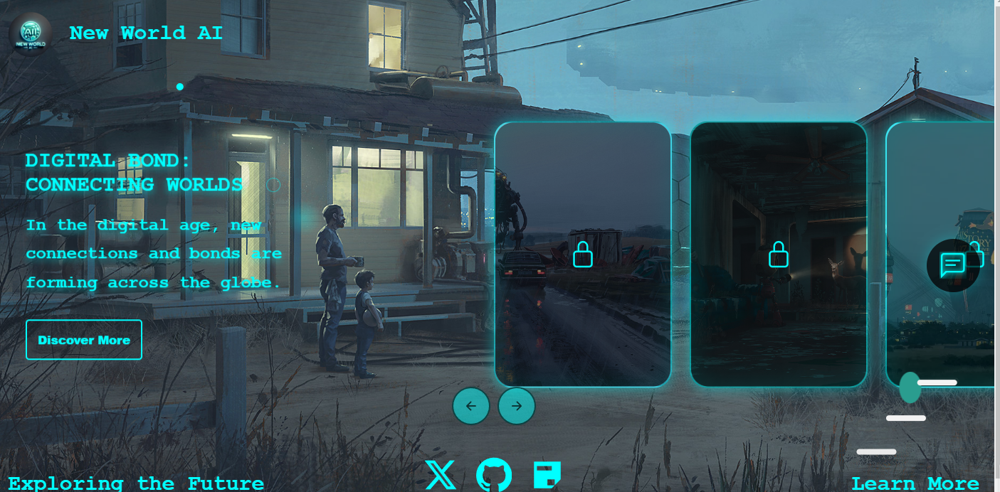

# New World AI

Welcome to **New World AI**, a Vue 3-based project powered by Vite. This application aims to explore and shape the future of artificial intelligence by presenting an intuitive and interactive digital experience for its users. With its sleek design, seamless interactivity, and cutting-edge technology, **New World AI** aspires to become a key tool in the development and understanding of AI-driven innovations.

## Project Overview

**New World AI** is not just a project—it's a vision. The application leverages the power of **Vue.js 3** and **Vite** to deliver a high-performance user interface, seamlessly blending technology and design. The platform features an interactive image carousel, a dynamic chat component, and a futuristic aesthetic to engage users and inspire curiosity about the transformative potential of AI.

Key Features:

- **Interactive Carousel:** A sleek, responsive carousel showcasing curated AI-related themes and content, providing both educational insights and inspiration.
- **Integrated Chat Functionality:** A dynamic chat interface designed for real-time interaction and user engagement.
- **Futuristic Design:** A visually immersive user interface with glowing neon elements, dynamic animations, and intuitive navigation.
- **Social Connectivity:** Direct integration with social media platforms such as Twitter, GitHub, and GitBook for extended community engagement.

## Technical Stack

**Framework:** Vue.js 3

**Build Tool:** Vite

**Styling:** Scoped CSS with dynamic animations (e.g., keyframes for glowing effects, adaptive design across screen sizes).

**Component Architecture:** Modular components for better reusability and scalability.

**External Libraries:**

- `@vue/cli` for component scaffolding.
- `ionicons` for elegant and lightweight icons.

## Project Setup

To get started with **New World AI**, follow the steps below:

### **Prerequisites**

Ensure you have the following tools installed:

- [Node.js](https://nodejs.org/)
- [npm](https://www.npmjs.com/)
- Recommended IDE: [VSCode](https://code.visualstudio.com/) + [Volar](https://marketplace.visualstudio.com/items?itemName=Vue.volar) (disable Vetur for optimal performance).

### **Installation**

Clone the repository and install the necessary dependencies:


```sh
git clone https://github.com/Newworldai/New-world-ai.git
cd Newworldai
npm install
```

### Development Mode

 Run the following command to start the development server with hot-reloading:

```sh
npm run dev
```

The development server will launch at http://localhost:5173/.



### Production Build

```sh
npm run build
```

The output files will be located in the `dist` directory. Use a static server (e.g., `serve`) to deploy your project

## **Code Architecture**

### **Components Overview**

1. ​	 **Main Interface**
   The entry point of the application, comprising a title, an image carousel, a chat interface, and a footer with social media links.
2. **Carousel Component**
   A dynamic slider that loops through items, each with an image, title, description, and actionable button.
3. **Chat Component**
   Integrated as a collapsible chat widget. Opens and closes dynamically, allowing users to interact with content intuitively.
4. **Footer Component**
   Contains links to external resources, including GitHub, GitBook, and Twitter for extended user engagement.

## Future Vision

 At its core, **New World AI** is more than a single-page application; it represents a commitment to innovation and exploration in AI. Below are some aspirations for the future development of this project:

1. **Enhanced AI Integration**
   - Embed AI-powered chatbots for interactive Q&A, support, and user guidance.
   - Integrate machine learning models to personalize the user experience based on interaction patterns.
2. **Educational Features**
   - Introduce AI courses and tutorials embedded within the carousel.
   - Enable real-time learning sessions and interactive demonstrations of AI principles.
3. **Community Collaboration**
   - Expand social connectivity to include forums and discussion groups.
   - Facilitate user contributions to content and design through GitHub integration.
4. **Advanced Visuals**
   - Implement 3D graphics using libraries like **Three.js** for immersive experiences.
   - Introduce interactive visualizations of AI processes and concepts.
5. **Scalability**
   - Expand the platform into a multi-page application for detailed content sections.
   - Integrate a backend system for data storage, user authentication, and analytics.

## **Contributing**

We welcome contributions from the community. If you have ideas, feature requests, or bug fixes, feel free to contribute:

1. Fork the repository.
2. Create a new branch for your feature/bugfix.
3. Commit your changes and push to the branch.
4. Submit a pull request with a detailed explanation of your changes.

## **Support**

For assistance or queries, please contact the development team via GitHub issues or email at [support@newworldai.com](mailto:support@newworldai.com).

## **Acknowledgments**

This project is a collaborative effort aimed at inspiring and empowering the global AI community. Special thanks to all contributors and supporters who have made **New World AI** a reality.

**New World AI** is more than just a project—it’s a journey toward a brighter, AI-driven future. Let’s shape the world together.

**Explore. Innovate. Transform.**